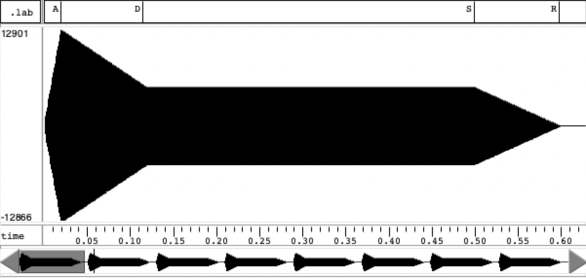
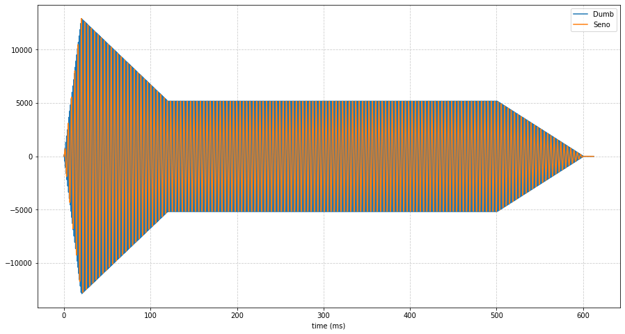
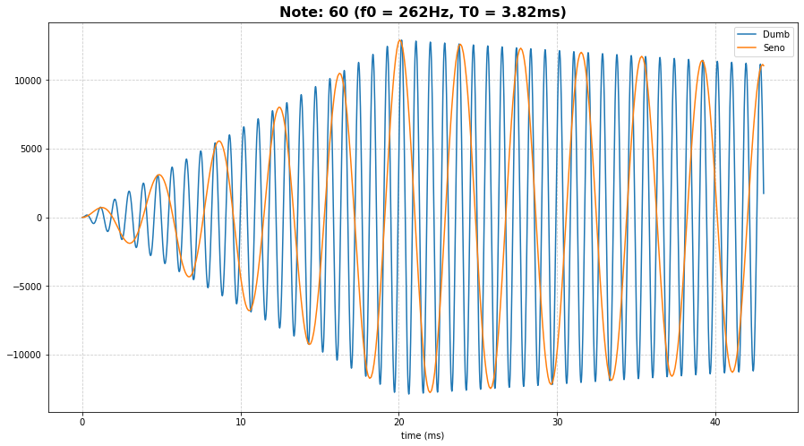

PAV - P5: síntesis musical polifónica
=====================================

Obtenga su copia del repositorio de la práctica accediendo a [Práctica 5](https://github.com/albino-pav/P5) 
y pulsando sobre el botón `Fork` situado en la esquina superior derecha. A continuación, siga las
instrucciones de la [Práctica 2](https://github.com/albino-pav/P2) para crear una rama con el apellido de
los integrantes del grupo de prácticas, dar de alta al resto de integrantes como colaboradores del proyecto
y crear la copias locales del repositorio.

Como entrega deberá realizar un *pull request* con el contenido de su copia del repositorio. Recuerde que
los ficheros entregados deberán estar en condiciones de ser ejecutados con sólo ejecutar:

~~~~~~~~~~~~~~~~~~~~~~~~~~~~~~~~~~~~~~~~~~~~~~~~~~~~~.sh
  make release
~~~~~~~~~~~~~~~~~~~~~~~~~~~~~~~~~~~~~~~~~~~~~~~~~~~~~

A modo de memoria de la práctica, complete, en este mismo documento y usando el formato *markdown*, los
ejercicios indicados.

Ejercicios.
-----------
### Tarea 1
Ejecute el script `midi2sco` con la opción `--help` para ver su modo de empleo, y úselo para
convertir al formato score el fichero MIDI `samples/Hawaii5-0.mid`. Visualice el fichero
para ver qué instrumentos participan en él. Analice el inicio de la partitura y determine
cómo comienza la canción.

Podemos observar que este fichero cuenta con 16 instrumentos (track: [1,16]), que pueden verse en la lista siguiente:
```
# // time:=0 track:1 text: ROLL                
# // time:=0 track:2 text: KICK SN             
# // time:=0 track:3 text: HAT                 
# // time:=0 track:4 text: TYMP                
# // time:=0 track:5 text: KICK 2              
# // time:=0 track:6 text: SNARE 2             
# // time:=0 track:7 text: TAMBORINE           
# // time:=0 track:8 text: BASS                
# // time:=0 track:9 text: GTR                 
# // time:=0 track:10 text: BRASS               
# // time:=0 track:11 text: HARD BRASS          
# // time:=0 track:12 text: FLUTE 1             
# // time:=0 track:13 text: FLUTE 2             
# // time:=0 track:14 text: TROMBONES           
# // time:=0 track:15 text: MORE BONES          
# // time:=0 track:16 text: HARD BRASS 2  
```

También observamos que la canción empieza con una serie de efectos de ROLL, en los que se cambia la duración y la velocidad, pero se mantiene el valor `Note = 40`, que corresponde a la nota Mi<sub>2</sub> (82.41Hz). Se utiliza solamente este instrumento hasta el instante time:=1.53834 aproximadamente.
```
2	9	1	40	21
25	8	1	40	64
0	9	1	40	6
20	8	1	40	64
12	9	1	40	12
29	8	1	40	64
0	9	1	40	18
20	8	1	40	64
...
```

### Envolvente ADSR.

Tomando como modelo un instrumento sencillo (puede usar el InstrumentDumb), genere cuatro instrumentos que
permitan visualizar el funcionamiento de la curva ADSR.

* Un instrumento con una envolvente ADSR genérica, para el que se aprecie con claridad cada uno de sus
  parámetros: ataque (A), caída (D), mantenimiento (S) y liberación (R).

  Se han escogido los siguientes valores: A = 0.02, D=0.1, S=0.4, R=0.1, N=40.

   </br>

* Un instrumento *percusivo*, como una guitarra o un piano, en el que el sonido tenga un ataque rápido, no
  haya mantenimiemto y el sonido se apague lentamente.
  - Para un instrumento de este tipo, tenemos dos situaciones posibles:
    * El intérprete mantiene la nota *pulsada* hasta su completa extinción.

      Como no hay mantenimiento, el tiempo que antes se le dedicaba a esta fase, ahora ha pasado a ser parte de la fase de caída. Se han usado: A = 0.02, D=0.5, S=0, R=0.1, N=40.

      </br>

    * El intérprete da por finalizada la nota antes de su completa extinción, iniciándose una disminución
	  abrupta del sonido hasta su finalización.
    
      En este caso no hay mantenimiento ni extinción. Tal como indica el  enunciado, podemos ver que el sonido finaliza de manera abrupta una vez acabada la fase de caída. Se han usado: A = 0.02, D=0.6, S=0, R=0, N=40.

      </br>

  - Debera representar en esta memoria **ambos** posibles finales de la nota.
* Un instrumento *plano*, como los de cuerdas frotadas (violines y semejantes) o algunos de viento. En
  ellos, el ataque es relativamente rápido hasta alcanzar el nivel de mantenimiento (sin sobrecarga), y la
  liberación también es bastante rápida.

  En este caso no hay fase de caida. Se han usado: A=0.06, D=0, S=0.5, R=0.06, N=40;

  </br>

Para los cuatro casos, deberá incluir una gráfica en la que se visualice claramente la curva ADSR. Deberá
añadir la información necesaria para su correcta interpretación, aunque esa información puede reducirse a
colocar etiquetas y títulos adecuados en la propia gráfica (se valorará positivamente esta alternativa).

### Instrumentos Dumb y Seno.

Implemente el instrumento `Seno` tomando como modelo el `InstrumentDumb`. La señal **deberá** formarse
mediante búsqueda de los valores en una tabla.

- Incluya, a continuación, el código del fichero `seno.cpp` con los métodos de la clase Seno.

  ```c++
  Seno::Seno(const std::string &param) 
  : adsr(SamplingRate, param) {
    bActive = false;
    x.resize(BSIZE);

    KeyValue kv(param);
    int N;

    if (!kv.to_int("N",N))
      N = 40; //default value
    
    //Create a tbl with one period of a sinusoidal wave
    tbl.resize(N);
    float phase = 0, istep = 0, step = 2 * M_PI /(float) N;
    index = 0;
    for (int i=0; i < N ; ++i) {
      tbl[i] = sin(phase);
      phase += step;
    }
  }

  void Seno::command(long cmd, long note, long vel) {
    if (cmd == 9) {		//'Key' pressed: attack begins
      bActive = true;
      adsr.start();
      
      f0 = pow(2, ((note - 69.) / 12.)) * 440.;
      istep = tbl.size() * M_PI * (f0 / SamplingRate);
      index = 0;
      A = vel / 127.; // Amplitud
    }
    else if (cmd == 8) {	//'Key' released: sustain ends, release begins
      adsr.stop();
    }
    else if (cmd == 0) {	//Sound extinguished without waiting for release to end
      adsr.end();
    }
  }

  const vector<float> & Seno::synthesize() {
    if (not adsr.active()) {
      x.assign(x.size(), 0);
      bActive = false;
      return x;
    }
    else if (not bActive)
      return x;

    for (unsigned int i=0; i<x.size(); ++i) {
      if (index == (int)index) {
        x[i] = A*tbl[index];
      } else {
        int upper = (int)ceil(index);
        int lower = (int)floor(index);
        x[i] = A*((upper - index)*tbl[lower % tbl.size()] + (index - lower)*tbl[upper % tbl.size()]);
      }
      index += istep;
      if (index >= tbl.size()) {
        index -= tbl.size();
      }
    }
  
    adsr(x); //apply envelope to x and update internal status of ADSR

    return x;
  }
  ```
- Explique qué método se ha seguido para asignar un valor a la señal a partir de los contenidos en la tabla,
  e incluya una gráfica en la que se vean claramente (use pelotitas en lugar de líneas) los valores de la
  tabla y los de la señal generada.

  Primero se calcula el valor de la frecuencia fundamental de la nota a partir de su valor en semitonos. Para ello se ha utilizado la siguiente fórmula: 
    
  ```c++
  f0 = pow(2, ((note - 69.) / 12.)) * 440.;
  ```
  El siguiente paso es calcular el incremento del índice de la tabla, que variará dependiendo de la frecuencia fundamental y la de muestreo. Hay que tener en cuenta que es muy posible que el resultado no sea un número entero, por lo que posteriormente habrá que "tratarlo" para conseguir x[i].

  Para calcular x[i] se ha utilizado el método de la interpolación lineal, calculando el valor de la muestra como una combinación lineal entre los valores inmediatamente anterior y posterior al índice deseado, con pesos α y 1 - α, teniendo en cuenta la distancia a los valores anteriores y posteriores.

  Podemos observar a continuación los valores obtenidos de la interpolación lineal a partir de la tabla dada:
  

  A continuación se adjuntan dos gráficas donde se compara la señal resultante de utilizar el instrumento `InstrumentDumb` con la resultante de utilizar el instrument `Seno`:
  
  
  
  Observamos que la señal generada con el instrumento `InstrumentDumb` no se adapta a la frecuencia deseada. En cambio, la señal generada con `Seno` tiene una frecuencia fundamental que coincide con la deseada, indicada en el fichero `doremi.sco` utilizado en la generación.

- Si ha implementado la síntesis por tabla almacenada en fichero externo, incluya a continuación el código
  del método `command()`.

### Efectos sonoros.

- Incluya dos gráficas en las que se vean, claramente, el efecto del trémolo y el vibrato sobre una señal
  sinusoidal. Deberá explicar detalladamente cómo se manifiestan los parámetros del efecto (frecuencia e
  índice de modulación) en la señal generada (se valorará que la explicación esté contenida en las propias
  gráficas, sin necesidad de *literatura*).

  **TREMOLO**
   </br>

  En la imagen se muestra el efecto del trémolo con diferentes profundidades de modulación (A) y frecuencias de modulación (fm). Este crea una envolvente en forma de sinusoidal alrededor de la señal original. Se aprecia sobre todo en la fase de mantenimiento. A mayor fm y mayor A, más perceptible es el efecto del trémolo.

  **VIBRATO**

   </br>

  Podemos apreciar cómo con este efecto se aprecian mucho más las oscilaciones en el espectrograma, responsables de esa ondulación perceptible al escuchar el audio (vibrato.wav).

  Comparación sin/con vibrato:
   </br>


- Si ha generado algún efecto por su cuenta, explique en qué consiste, cómo lo ha implementado y qué
  resultado ha producido. Incluya, en el directorio `work/ejemplos`, los ficheros necesarios para apreciar
  el efecto, e indique, a continuación, la orden necesaria para generar los ficheros de audio usando el
  programa `synth`.

  **DISTORSIÓN** </br>
  La distorsión consiste en recortar la señal que supere un cierto umbral para provocar un efecto de que la señal está "rota". La orden necesaria para ejecutarlo es:
  ```bash
  synth -e effects.orc  instrumento.orc partitura.sco name_out.wav
  ```
  Se ha generado el archivo distorsion.wav, donde se aplica el efecto en la 3ª, 4ª y 5ª nota. A continuación se muestra el efecto de la distorsión con un umbral de 0.5, hecho que provoca una onda con los extremos cuadrados. A mayor umbral, más acusado será el efecto.
   </br></br>
   </br>


### Síntesis FM.

Construya un instrumento de síntesis FM, según las explicaciones contenidas en el enunciado y el artículo
de [John M. Chowning](https://web.eecs.umich.edu/~fessler/course/100/misc/chowning-73-tso.pdf). El
instrumento usará como parámetros **básicos** los números `N1` y `N2`, y el índice de modulación `I`, que
deberá venir expresado en semitonos.

- Use el instrumento para generar un vibrato de *parámetros razonables* e incluya una gráfica en la que se
  vea, claramente, la correspondencia entre los valores `N1`, `N2` e `I` con la señal obtenida.
  
  El valor del parámetro `I` indica el índice de modulación de la frecuencia moduladora `fm`, de tal forma que si aumentamos su valor, más importante es el efecto de la modulación. 
  Por otro lado, los valores `N1` y `N2` afectan al ratio entre la frecuencia portadora `fc` y la de modulación `fm`, de manera que se cumple que ```fc/fm = N1/N2```. Para un valor de `I` pequeño, se puede apreciar una sinusoide más marcada dentro de la señal, que corresponde a la forma de la modulación.
  
  
  

- Use el instrumento para generar un sonido tipo clarinete y otro tipo campana. Tome los parámetros del
  sonido (N1, N2 e I) y de la envolvente ADSR del citado artículo. Con estos sonidos, genere sendas escalas
  diatónicas (fichero `doremi.sco`) y ponga el resultado en los ficheros `work/doremi/clarinete.wav` y
  `work/doremi/campana.work`.
  
  Para generar el clarinete los parámetros necesarios son:
  ADSR_A=0.02; ADSR_D=0.1; ADSR_S=0.4; ADSR_R=0.1; N=40; N1=8; N2=4; I=4;

  Para generar la campana, primero hay que modificar los parámetros ADSR para que se ajusten a la duración especificada en el paper. A continuación, dividiendo la frcuencia carrier y la de modulación sabemos N1 y N2. Los parámetros son:
  ADSR_A=0.2; ADSR_D=1; ADSR_S=0; ADSR_R=0.3; N=40; N1=5; N2=7; I=4; **CORREGIR, NO SUENA MUY BIEN**
  

  Al incrementar el valor de I y hacer la frecuencia de modulación de magnitud comparable a la frecuencia central, la percepción ya no es la de un vibrato, sino la de un sonido con un timbre diferente.

  * También puede colgar en el directorio work/doremi otras escalas usando sonidos *interesantes*. Por
    ejemplo, violines, pianos, percusiones, espadas láser de la
	[Guerra de las Galaxias](https://www.starwars.com/), etc.

### Orquestación usando el programa synth.

Use el programa `synth` para generar canciones a partir de su partitura MIDI. Como mínimo, deberá incluir la
*orquestación* de la canción *You've got a friend in me* (fichero `ToyStory_A_Friend_in_me.sco`) del genial
[Randy Newman](https://open.spotify.com/artist/3HQyFCFFfJO3KKBlUfZsyW/about).

- En este triste arreglo, la pista 1 corresponde al instrumento solista (puede ser un piano, flautas,
  violines, etc.), y la 2 al bajo (bajo eléctrico, contrabajo, tuba, etc.).
- Coloque el resultado, junto con los ficheros necesarios para generarlo, en el directorio `work/music`.
- Indique, a continuación, la orden necesaria para generar la señal (suponiendo que todos los archivos
  necesarios están en directorio indicado).

También puede orquestar otros temas más complejos, como la banda sonora de *Hawaii5-0* o el villacinco de
John Lennon *Happy Xmas (War Is Over)* (fichero `The_Christmas_Song_Lennon.sco`), o cualquier otra canción
de su agrado o composición. Se valorará la riqueza instrumental, su modelado y el resultado final.
- Coloque los ficheros generados, junto a sus ficheros `score`, `instruments` y `effects`, en el directorio
  `work/music`.
- Indique, a continuación, la orden necesaria para generar cada una de las señales usando los distintos
  ficheros.
